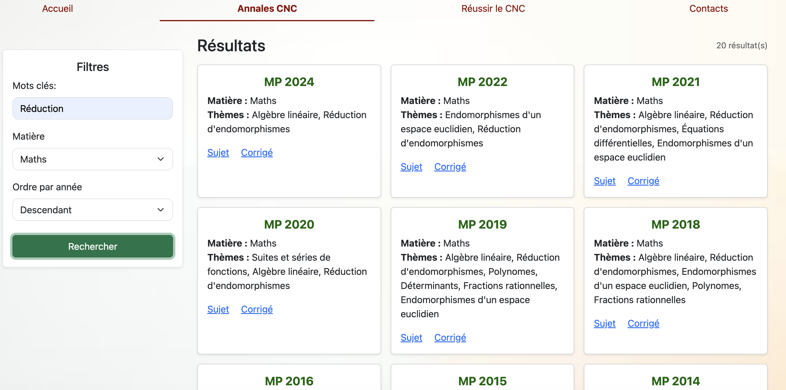

# 📘 Prepa fl maghrib

Une plateforme web destinée aux élèves des CPGE MP du Maroc, proposant
des informations générales sur les CPGE, un moteur de recherche d’annales 
du CNC (Concours national commun), et des conseils et ressources pour réussir
sa prépa.

---

## 🎯 Contexte

Les informations concernant les classes préparatoires aux grandes écoles
(CPGE) au Maroc sont souvent dispersées et peu accessibles.  
Ce projet vise à centraliser ces informations et à fournir aux étudiants
des ressources utiles pour mieux se préparer aux concours.

---

## 🚀 Fonctionnalités

- Présentation des informations essentielles concernant la prépa MP au Maroc (concours, admission, bourses).
- Recherche d’annales du CNC (par année, matière, et concours).
- Conseils et ressources pour réussir en CPGE.

---

## Interface
<p align="center">
  
</p>

---

## 🛠️ Technologies utilisées

- Backend : Python avec le framework Flask
- Frontend : HTML, CSS, JavaScript, Jinja2, Bootstrap
- Base de données : SQLite

---

## ⚙️ Installation et lancement

1. Cloner le dépôt :
```bash
git clone https://github.com/yaoureda/prepaflmaghrib.git
cd prepaflmaghrib
```

2. Créer et activer un environnement virtuel à partir du terminal :
**Sur Windows (Command Prompt):**
```cmd
python -m venv venv
venv\Scripts\activate.bat
```

**Sur Windows (PowerShell):**
```powershell
python -m venv venv
venv\Scripts\Activate.ps1
```

**Sur macOS/Linux:**
```bash
python3 -m venv venv
source venv/bin/activate
```

> Cela crée un dossier nommé `venv` dans le répertoire du projet.

3. Installer les dépendances et lancer l'application :
```bash
pip install -r requirements.txt
python run.py
```

> L'application sera lancée sur: **http://localhost:5000**

---

## 🌐 Démo en ligne

Le site est disponible ici : [prepaflmaghrib](https://prepaflmaghrib.onrender.com)

Vous pouvez naviguer entre les pages :
- Accueil
- Annales CNC
- Réussir le CNC
- Contacts

⚠️ Le site est hébergé sur Render (free tier) : il peut mettre jusqu’à 1 minute à démarrer après une période d’inactivité.

---

## 🧾 Améliorations possibles

- Traduction de la plateforme en arabe.
- Ajout des annales d'autres filières que la MP.
- Étayer plus la page "Réussir le CNC".

---

## 📁 Structure du projet

```
prepaflmaghrib/
├── app
│   ├── __init__.py
│   ├── database
│   │   ├── __init__.py
│   │   ├── annales
│   │   │   ├── annalesChimie.json
│   │   │   ├── annalesInformatique.json
│   │   │   ├── annalesMaths.json
│   │   │   ├── annalesPhysique.json
│   │   │   └── annalesSI.json
│   │   ├── database.db
│   │   ├── database.py
│   │   └── models.py
│   ├── static
│   │   ├── css
│   │   │   ├── accueil.css
│   │   │   ├── annales.css
│   │   │   ├── base.css
│   │   │   ├── contacts.css
│   │   │   └── reussir.css
│   │   ├── images
│   │   │   └── background.jpeg
│   │   ├── js
│   │   │   └── annales.js
│   │   └── pdfs
│   │       ├── connecteurs.pdf
│   │       └── methodologie.pdf
│   └── templates
│       ├── accueil.html
│       ├── annales.html
│       ├── base.html
│       ├── contacts.html
│       └── reussir.html
├── README.md
├── requirements.txt
└── run.py
```

